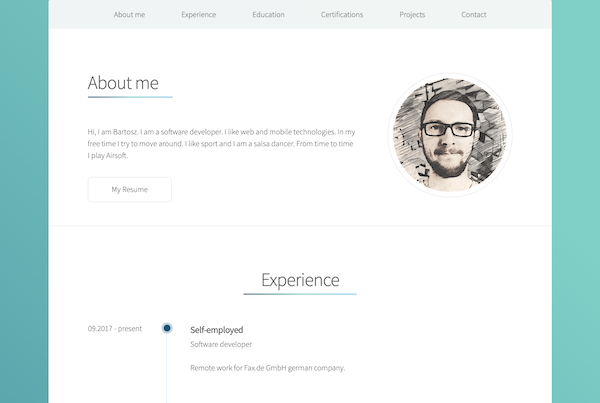

    

  <h1 align="center">Portfolio</h1>

  

    My portfolio page created in pure HTML and CSS
     
     
    <a href="https://bartoszbialecki.github.io/Portfolio/">View Demo</a>
  

## Used technologies and tools
- Google Fonts - the site uses the Source Sans Pro font from Google Fonts
- Font Awesome - the site uses it for social and email icons
- Normalize.css - the site uses it to make browsers render all elements consistently
- Parcel - this is a web application bundler and is used to create a site or a web application. Parcel has a development server built in, which will automatically rebuild the app as soon as files will change
- PostCSS - this is a tool for transforming CSS with plugins like `autoprefixer` used in this project
- gh-pages - this tool helps to publish the site at GitHub Pages

## Screenshots

    

  

  

